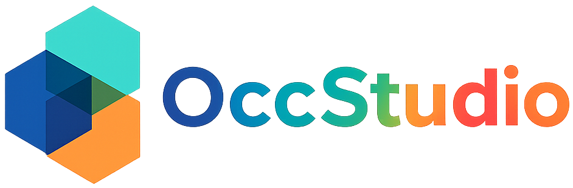

<p align="center" style="margin: 0;">
  
</p>

<p align="center">
    <a href="https://opensource.org/licenses/Apache-2.0"></a>
    <a href="https://www.python.org/"></a>
    <a href="https://pytorch.org/"></a>
    <a href="https://github.com/cdb342/OccStudio/pulls"></a>
</p>


Welcome to **OccStudio**, a unified framework for 3D Occupancy Prediction. This project unifies our previous works, including ALOcc, CausalOcc, and GDFusion, along with multiple classic methods into a single, standardized codebase to support research in autonomous driving, embodied AI, and other intelligent systems.

The framework is designed to handle both Semantic Occupancy and Occupancy Flow prediction, supporting a wide variety of input modalities, feature encoding methods,  temporal fusion strategies, image backbones, etc. Our goal is to provide a flexible foundation to accelerate research in Spatial Intelligence across academia and industry.

---

## 🌟 Highlights

- 🏆 **A Unified Framework**: Provides a common codebase for multiple occupancy prediction methods, including **ALOcc**, **CausalOcc**, **GDFusion**, **BEVDetOcc**, **FB-Occ**, etc.
- 🔧 **Flexible and Configurable Architecture**: Supports multiple input modalities (e.g., **images**, **depth**), various types of 3D feature encoding (e.g., **Volume-based**, **BEV-based**), different temporal fusion methods (e.g., **SoloFusion**, **GDFusion**), and different image backbones (e.g., **Resnet**, **InterImage**, **Swin-Transformer**), all of which are switchable via configuration.
- 📚 **Dataset Support**: Provides full support for large-scale datasets like **nuScenes** and **Waymo**, and allows for seamlessly switching between different occupancy annotation formats (e.g., **Occ3D**, **SurroundOcc**, **OpenOccupancy**) for robust experimentation.

---

## 🛠 Model Zoo

OccStudio currently supports the following models:

| Method        | Task                      | Publication |
|---------------|---------------------------|-------------|
| [ALOcc](https://arxiv.org/abs/2411.07725)         | Semantic Occupancy & Flow | ICCV 2025   |
| [GDFusion](https://arxiv.org/abs/2504.12959)      | Semantic Occupancy        | CVPR 2025   |
| [BEVDetOcc](https://arxiv.org/abs/2112.11790)     | Semantic Occupancy        | -           |
| [FB-Occ](https://github.com/NVlabs/FB-BEV)        | Semantic Occupancy        | ICCV 2023   |
| [SparseOcc](https://github.com/MCG-NJU/SparseOcc)     | Semantic Occupancy        | ECCV 2024   |

---

## 🚀 Get Started

### 1. Installation

We recommend using Conda for environment management.

```bash
# Clone this repository (replace OccStudio with your actual repo name)
git clone https://github.com/cdb342/OccStudio
cd OccStudio

# Create and activate the conda environment
conda create -n OccStudio python=3.8 -y
conda activate OccStudio

# Install PyTorch dependencies (for CUDA 11.8)
pip install torch==2.0.1+cu118 torchvision==0.15.2+cu118 -f https://download.pytorch.org/whl/torch_stable.html

# Install MMCV dependencies
git clone https://github.com/open-mmlab/mmcv
cd mmcv
git checkout 1.x # Use the stable 1.x branch
MMCV_WITH_OPS=1 pip install -e . -v
cd ..

# Install MMDetection and MMSegmentation
pip install mmdet==2.28.2 mmsegmentation==0.30.0

# Install the OccStudio framework itself
pip install -v -e .

# Install other dependencies
pip install torchmetrics timm dcnv4 ninja spconv transformers IPython einops
pip install numpy==1.23.4 # Pin numpy version for compatibility

# (Optional for SparseOcc)
cd mmdet3d/models/sparseocc/csrc
pip install -v -e .
```

### 2. Data Preparation

#### **nuScenes**

1.  Download the full nuScenes dataset from the [official website](https://www.nuscenes.org/download).
2.  Download the Occ3D nuScenes annotations from the [project page](https://tsinghua-mars-lab.github.io/Occ3D/).
3.  (Optional) Download other community annotations for extended experiments:
    *   [OpenOcc_v2.1 Annotations](https://github.com/OpenDriveLab/OccNet?tab=readme-ov-file#openocc-dataset)
    *   [OpenOcc_v2.1 Ray Mask](https://drive.google.com/file/d/10jB08Z6MLT3JxkmQfxgPVNq5Fu4lHs_h/view)
    *   [SurroundOcc Annotations](https://github.com/weiyithu/SurroundOcc) (rename to `gts_surroundocc`)
    *   [OpenOccupancy-v0.1 Annotations](https://github.com/JeffWang987/OpenOccupancy)

Please organize the data into the following directory structure:

```
├── data
│   ├── nuscenes
│   │   ├── maps, samples, sweeps, v1.0-test, v1.0-trainval
│   │   ├── gts                 # Occ3D annotations
│   │   ├── gts_surroundocc     # (Optional) SurroundOcc annotations
│   │   ├── openocc_v2          # (Optional) OpenOcc annotations
│   │   ├── openocc_v2_ray_mask # (Optional) OpenOcc ray mask
│   │   └── nuScenes-Occupancy-v0.1 # (Optional) OpenOccupancy annotations
```


Finally, run the preprocessing scripts:


```bash
# 1. Extract semantic segmentation labels from LiDAR
python tools/nusc_process/extract_sem_point.py

# 2. Create formatted info files for the dataloader
PYTHONPATH=$(pwd):$PYTHONPATH python tools/create_data_bevdet.py
```
Alternatively, you can download the pre-processed [`segmentation labels`](https://huggingface.co/Dobbin/OccStudio/blob/main/lidar_seg.zip), [`train.pkl`](https://huggingface.co/Dobbin/OccStudio/blob/main/bevdetv2-nuscenes_infos_train.pkl) and [`val.pkl`](https://huggingface.co/Dobbin/OccStudio/blob/main/bevdetv2-nuscenes_infos_val.pkl) files from our Hugging Face Hub, and organize their path as:
```
ALOcc/
├── data/
│   ├── lidar_seg
│   ├── nuscenes/
│   │   ├── train.pkl
│   │   ├── val.pkl
│   │   ...
..
```

#### **Waymo**

1. Download the Waymo Open Dataset from the [official website](https://waymo.com/open/download/).
2. Download the Occ3D Waymo annotations and pkl files from [here](https://github.com/Tsinghua-MARS-Lab/CVT-Occ/blob/main/docs/dataset.md).
3. Follow the official instructions to organize the files.

### 3. Pre-trained Models

For training, please download pre-trained image backbones from [BEVDet GitHub](https://github.com/HuangJunJie2017/BEVDet), [GeoMIM GitHub](https://github.com/Sense-X/GeoMIM), or [Hugging Face Hub](https://huggingface.co/Dobbin/alocc). Place them in the `ckpts/pretrain/` directory.


---

## 🎮 Usage

### Training

Use the following script for distributed training.

```bash
# Syntax: bash tools/dist_train.sh [CONFIG_FILE] [WORK_DIR] [NUM_GPUS]
# Example: Train the ALOcc-3D model
bash tools/dist_train.sh configs/alocc/alocc_3d_256x704_bevdet_preatrain.py work_dir/alocc_3d 8
```

### Testing

Download our pre-trained models from [Hugging Face](https://huggingface.co/Dobbin/alocc) and run the testing script.

```bash
# Evaluate semantic occupancy (mIoU) or occupancy flow
# Syntax: bash tools/dist_test.sh [CONFIG_FILE] [CHECKPOINT_PATH] [NUM_GPUS]
# Example: Evaluate the ALOcc-3D model
bash tools/dist_test.sh configs/alocc/alocc_3d_256x704_bevdet_preatrain.py ckpts/alocc_3d_256x704_bevdet_preatrain.pth 8

# Evaluate semantic occupancy (RayIoU)
# Syntax: bash tools/dist_test_ray.sh [CONFIG_FILE] [CHECKPOINT_PATH] [NUM_GPUS]
# Example: Evaluate the ALOcc-3D model
bash tools/dist_test.sh configs/alocc/alocc_3d_256x704_bevdet_preatrain_wo_mask.py ckpts/alocc_3d_256x704_bevdet_preatrain_wo_mask.pth 8
```

> **Note:** When performing inference with temporal fusion, please use **1 or 8 GPUs**. A sampler bug may cause duplicate sample counting with other GPU configurations.

### Benchmarking

We provide convenient tools to benchmark model FPS (Frames Per Second) and FLOPs.

```bash
# Benchmark FPS
# Syntax: python tools/analysis_tools/benchmark.py [CONFIG_FILE]
# Example: Benchmark the ALOcc-3D model
python tools/analysis_tools/benchmark.py configs/alocc/alocc_3d_256x704_bevdet_preatrain.py

# Calculate FLOPs
# Syntax: python tools/analysis_tools/get_flops.py [CONFIG_FILE] --modality image --shape 256 704
# Example: Calculate FLOPs for the ALOcc-3D model
python tools/analysis_tools/get_flops.py configs/alocc/alocc_3d_256x704_bevdet_preatrain.py --modality image --shape 256 704
```
###  Visualization

First, ensure you have Mayavi installed. You can install it using pip:

```bash
pip install mayavi
```
Before you can visualize the output, you need to run the model on the test set and save the prediction results.

Use the `dist_test.sh` script with the `--save` flag. This will store the model's output in a directory.

```bash
# Example: Evaluate the ALOcc-3D model and save the predictions
bash tools/dist_test.sh configs/alocc/alocc_3d_256x704_bevdet_preatrain.py ckpts/alocc_3d_256x704_bevdet_preatrain.pth 8 --save
```

The prediction results will be saved in the `test/` directory, following a path structure like: `test/[CONFIG_NAME]/[TIMESTAMP]/`.

Once the predictions are saved, you can run the visualization script. This script requires the path to the prediction results and the path to the ground truth data.

```bash
# Syntax: python tools/visual.py [PREDICTION_PATH] [GROUND_TRUTH_PATH]
# Example:
python tools/visual.py work_dirs/alocc_3d_256x704_bevdet_preatrain/xxxxxxxx_xxxxxx/ your/path/to/ground_truth
```

*   Replace `work_dirs/alocc_3d_256x704_bevdet_preatrain/xxxxxxxx_xxxxxx/` with the actual path to your saved prediction results from Step 2.
*   Replace `your/path/to/ground_truth` with the path to the corresponding ground truth dataset.

This will launch an interactive Mayavi window where you can inspect and compare the 3D occupancy predictions.

## 📊 Main Results

Here are the performance benchmarks of models implemented in **OccStudio**. The results below are for the `ALOcc` series.

<summary><b>🏆 Performance on nuScenes (Models on Occ3D Are Trained with Camera Visible Mask)</b></summary>

| Model | Annotation | Backbone | Input | Input Size | mIoU | mIoU_D | IoU | FPS | Memory | Checkpoint | Config |
|:---:|:---:|:---:|:---:|:---:|:---:|:---:|:---:|:---:|:---:|:---:|:---:|
| **BEVDetOcc-SF** | Occ3D | R-50 | C | `256x704` | **41.9** | 34.4 | 75.1 | 6.5 | 10717 | [🤗 HF](https://huggingface.co/Dobbin/OccStudio/blob/main/bevdetocc_r50_bevdet_pretrain_solofusion_16f.pth) | [config](./configs/bevdetocc/bevdetocc_r50_256x704_bevdet_pretrain_solofusion_16f.py) |
| **BEVDetOcc-GF** | Occ3D | R-50 | C | `256x704` | **43.6** | 36.1 | 77.8 | 7.0 | 3017 | [🤗 HF](https://huggingface.co/Dobbin/OccStudio/blob/main/bevdetocc_r50_256x704_bevdet_pretrain_gdfusion.pth) | [config](configs/gdfusion/bevdetocc_r50_256x704_bevdet_pretrain_gdfusion.py) |
| **FB-Occ** | Occ3D | R-50 | C | `256x704` | **39.8** | 34.2 | 69.9 | 10.3 | 4099 | [🤗 HF](https://huggingface.co/Dobbin/OccStudio/blob/main/fbocc-r50-cbgs_depth_16f_16x4_20e.pth) | [config](./configs/fbocc/fbocc-r50-cbgs_depth_16f_16x4_20e.py) |
| **FB-Occ-GF** | Occ3D | R-50 | C | `256x704` | **42.1** | 36.4 | 73.3 | 10.3 | 2879 | [🤗 HF](https://huggingface.co/Dobbin/OccStudio/blob/main/fbocc-r50-cbgs_depth_16f_16x4_20e_gdfusion.pth) | [config](configs/gdfusion/fbocc-r50-cbgs_depth_16f_16x4_20e_gdfusion.py) |
| **ALOcc-2D-mini** | Occ3D | R-50 | C | `256x704` | **41.4** | 35.4 | 70.0 | 30.5 | 1605 | [🤗 HF](https://huggingface.co/Dobbin/OccStudio/blob/main/alocc_2d_mini_r50_256x704_bevdet_preatrain_16f.pth) | [config](./configs/alocc/alocc_2d_mini_r50_256x704_bevdet_preatrain_16f.py) |
| **ALOcc-2D** | Occ3D | R-50 | C | `256x704` | **44.8** | 38.7 | 74.3 | 8.2 | 5553 | [🤗 HF](https://huggingface.co/Dobbin/OccStudio/blob/main/alocc_2d_r50_256x704_bevdet_preatrain_16f.pth) | [config](./configs/alocc/alocc_2d_r50_256x704_bevdet_preatrain_16f.py) |
| **ALOcc-3D** | Occ3D | R-50 | C | `256x704` | **45.5** | 39.3 | 75.3 | 6.0 | 10793 | [🤗 HF](https://huggingface.co/Dobbin/OccStudio/blob/main/alocc_3d_r50_256x704_bevdet_preatrain_16f.pth) | [config](./configs/alocc/alocc_3d_r50_256x704_bevdet_preatrain_16f.py) |
| **ALOcc-3D** | Occ3D | R-50 | C+D | `256x704` | **54.5** | 50.6 | 85.2 | 6.0 | 13003 | [🤗 HF](https://huggingface.co/Dobbin/OccStudio/blob/main/alocc_3d_r50_256x704_bevdet_preatrain_16f_gt_depth.pth) | [config](configs/alocc/alocc_3d_r50_256x704_bevdet_preatrain_16f_gt_depth.py) |
| **ALOcc-3D** | Occ3D | Intern-T | C+D | `256x704` | **55.6** | 52.4 | 85.1 | 5.8 | 13015 | [🤗 HF](https://huggingface.co/Dobbin/OccStudio/blob/main/alocc_3d_internimage_tiny_256x704_bevdet_preatrain_16f_gt_depth.pth) | [config](configs/alocc/alocc_3d_internimage_tiny_256x704_bevdet_preatrain_16f_gt_depth.py) |
| **ALOcc-3D** | Occ3D | Swin-Base | C+D | `512x1408` | **60.0** | 57.8 | 87.8 | 1.5 | 26867 | [🤗 HF](https://huggingface.co/Dobbin/OccStudio/blob/main/alocc_3d_swin_base_512x1408_geomim_preatrain_16f_gt_depth.pth) | [config](configs/alocc/alocc_3d_swin_base_512x1408_geomim_preatrain_16f_gt_depth.py) |
| **ALOcc-3D-GF** | Occ3D | R-50 | C | `256x704` | **46.5** | 40.2 | 77.4 | 6.2 | 4347 | [🤗 HF](https://huggingface.co/Dobbin/OccStudio/blob/main/alocc_3d_r50_256x704_bevdet_preatrain_gdfusion.pth) | [config](configs/gdfusion/alocc_3d_r50_256x704_bevdet_preatrain_gdfusion.py) |
| **ALOcc-3D-GF** | Occ3D | R-50 | C+D | `256x704` | **54.9** | 51.4 | 85.9 | 6.2 | 6561 | [🤗 HF](https://huggingface.co/Dobbin/OccStudio/blob/main/alocc_3d_r50_256x704_bevdet_preatrain_gdfusion.pth) | [config](configs/gdfusion/alocc_3d_r50_256x704_bevdet_preatrain_gdfusion.py) 
| **ALOcc-2D-GF** | OpenOccupancy | R-50 | C | `900x1600` | **17.9** | 13.7 | 28.6 | 0.8 | 13857 | [🤗 HF](https://huggingface.co/Dobbin/OccStudio/blob/main/alocc_2d_r50_900x1600_bevdet_preatrain_gdfusion_openoccupancy.pth) | [config](configs/gdfusion/alocc_2d_r50_900x1600_bevdet_preatrain_gdfusion_openoccupancy.py) |
| **ALOcc-2D-GF** | OpenOccupancy | R-50 | C+D | `900x1600` | **24.5** | 21.6 | 34.5 | 0.8 | 13891 | [🤗 HF](https://huggingface.co/Dobbin/OccStudio/blob/main/alocc_2d_r50_900x1600_bevdet_preatrain_gt_depth_gdfusion_openoccupancy.pth) | [config](configs/gdfusion/alocc_2d_r50_900x1600_bevdet_preatrain_gt_depth_gdfusion_openoccupancy.py) |
| **ALOcc-2D-mini*** | SurroundOcc | R-50 | C | `900x1600` | **21.5** | 19.5 | 31.5 | 5.8 | 2869 | [🤗 HF](https://huggingface.co/Dobbin/OccStudio/blob/main/alocc_2d_mini_r50_256x704_bevdet_preatrain_surroundocc.pth) | [config](configs/alocc/alocc_2d_mini_r50_256x704_bevdet_preatrain_surroundocc.py) |
| **ALOcc-3D*** | SurroundOcc | R-50 | C | `900x1600` | **24.0** | 21.7 | 34.7 | 1.7 | 11117 | [🤗 HF](https://huggingface.co/Dobbin/OccStudio/blob/main/alocc_3d_r50_900x1600_bevdet_preatrain_surroundocc.pth) | [config](configs/alocc/alocc_3d_r50_900x1600_bevdet_preatrain_surroundocc.py) |
| **ALOcc-3D-GF** | SurroundOcc | R-50 | C | `900x1600` | **25.5** | 22.5 | 38.2 | 0.9 | 11857 | [🤗 HF](https://huggingface.co/Dobbin/OccStudio/blob/main/alocc_3d_r50_900x1600_bevdet_preatrain_gdfusion_surroundocc.pth) | [config](configs/gdfusion/alocc_3d_r50_900x1600_bevdet_preatrain_gdfusion_surroundocc.py) |


<summary><b>🏆 Performance on nuScenes (Trained w/o Camera Visible Mask)</b></summary>

| Model | Annotation | Backbone | Input | Input Size | mIoU | RayIoU | RayIoU<sub>1m, 2m, 4m</sub> | FPS | Memory | Checkpoint | Config |
|:---|:---:|:---:|:---:|:---:|:---:|:---:|:---:|:---:|:---:|:---:|:---:|
| **BEVDetOcc-SF** | Occ3D | R-50 | C | `256x704` | 24.3 | **35.2** | 31.2, 35.9, 38.4 | 6.5 | 10717 | [🤗 HF](https://huggingface.co/Dobbin/OccStudio/blob/main/bevdetocc_r50_bevdet_pretrain_solofusion_16f_wo_mask.pth) | [config](./configs/bevdetocc/bevdetocc_r50_256x704_bevdet_pretrain_solofusion_16f_wo_mask.py) |
| **FB-Occ** | Occ3D | R-50 | C | `256x704` | 31.1 | **39.0** | 33.0, 39.9, 44.0 | 10.3 | 4099 | [🤗 HF](https://huggingface.co/Dobbin/OccStudio/blob/main/fbocc-r50-cbgs_depth_16f_16x4_20e_wo_mask.pth) | [config](./configs/fbocc/fbocc-r50-cbgs_depth_16f_16x4_20e_wo_mask.py) |
| **SparseOcc** | Occ3D | R-50 | C | `256x704` | 26.6 | **32.5** | 26.2, 33.2, 38.1 | - | 5967 | [🤗 HF](https://huggingface.co/Dobbin/OccStudio/blob/main/r50_nuimg_704x256_8f.pth) | [config](configs/sparseocc/r50_nuimg_704x256_8f.py) |
| **ALOcc-2D-mini** | Occ3D | R-50 | C | `256x704` | 33.4 | **39.3** | 32.9, 40.1, 44.8 | 30.5 | 1605 | [🤗 HF](https://huggingface.co/Dobbin/OccStudio/blob/main/alocc_2d_mini_r50_256x704_bevdet_preatrain_16f_wo_mask.pth) | [config](./configs/alocc/alocc_2d_mini_r50_256x704_bevdet_preatrain_16f_wo_mask.py) |
| **ALOcc-2D** | Occ3D | R-50 | C | `256x704` | 37.4 | **43.0** | 37.1, 43.8, 48.2 | 8.2 | 5553 | [🤗 HF](https://huggingface.co/Dobbin/OccStudio/blob/main/alocc_2d_r50_256x704_bevdet_preatrain_16f_wo_mask.pth) | [config](./configs/alocc/alocc_2d_r50_256x704_bevdet_preatrain_16f_wo_mask.py) |
| **ALOcc-3D** | Occ3D | R-50 | C | `256x704` | 38.0 | **43.7** | 37.8, 44.7, 48.8 | 6.0 | 10793 | [🤗 HF](https://huggingface.co/Dobbin/OccStudio/blob/main/alocc_3d_r50_256x704_bevdet_preatrain_16f_wo_mask.pth) | [config](./configs/alocc/alocc_3d_r50_256x704_bevdet_preatrain_16f_wo_mask.py) |
| **ALOcc-3D-GF** | Occ3D | R-50 | C | `256x704` | 38.4 | **44.1** | 38.1, 45.1, 49.3 | 6.2 | 4347 | [🤗 HF](https://huggingface.co/Dobbin/OccStudio/blob/main/alocc_3d_r50_256x704_bevdet_preatrain_gdfusion_wo_mask.pth) | [config](./configs/alocc/alocc_3d_r50_256x704_bevdet_preatrain_16f_wo_mask.py) |


<summary><b>🏆 Performance on OpenOcc (Semantic Occupancy and Flow)</b></summary>

| Method | Annotation | Backbone | Input | Input Size | Occ Score | mAVE | mAVE<sub>TP</sub> | RayIoU | RayIoU<sub>1m, 2m, 4m</sub> | FPS | Checkpoint | Config |
|:---|:---:|:---:|:---:|:---:|:---:|:---:|:---:|:---:|:---:|:---:|:---:|:---:|
| **ALOcc-Flow-2D** | Occ3D | R-50 | C | `256x704` | **41.9** | 0.530 | 0.431 | 40.3 | 34.3, 41.0, 45.5 | 7.0 | [🤗 HF](https://huggingface.co/Dobbin/OccStudio/blob/main/alocc_flow_2d_r50_256x704.pth) | [config](https://huggingface.co/Dobbin/OccStudio/blob/main/alocc_flow_2d_r50_256x704.py) |
| **ALOcc-Flow-3D** | Occ3D | R-50 | C | `256x704` | **43.1** | 0.549 | 0.458 | 41.9 | 35.6, 42.9, 47.2 | 5.5 |  [🤗 HF](https://huggingface.co/Dobbin/OccStudio/blob/main/alocc_flow_3d_r50_256x704.pth) |[config](https://huggingface.co/Dobbin/OccStudio/blob/main/alocc_flow_3d_r50_256x704.py) |


---

## 🤝 Contribution

We welcome contributions from the community! If you find a bug, have a feature request, or want to contribute new models to OccStudio, please feel free to open an issue or submit a pull request.

---

## 🙏 Acknowledgement

We gratefully acknowledge the foundational work of many excellent open-source projects, and we would like to extend our special thanks to:

- [open-mmlab](https://github.com/open-mmlab)
- [BEVDet](https://github.com/HuangJunJie2017/BEVDet)
- [FB-Occ](https://github.com/NVlabs/FB-BEV)
- [FlashOcc](https://github.com/Yzichen/FlashOCC)
- [Occ3D](https://github.com/Tsinghua-MARS-Lab/Occ3D)

---

## 📜 Citation

If you find OccStudio useful in your research, please consider citing our relevant papers:

```bibtex
@InProceedings{chen2025rethinking,
    author    = {Chen, Dubing and Zheng, Huan and Fang, Jin and Dong, Xingping and Li, Xianfei and Liao, Wenlong and He, Tao and Peng, Pai and Shen, Jianbing},
    title     = {Rethinking Temporal Fusion with a Unified Gradient Descent View for 3D Semantic Occupancy Prediction},
    booktitle = {Proceedings of the IEEE/CVF Conference on Computer Vision and Pattern Recognition (CVPR)},
    month     = {June},
    year      = {2025},
    pages     = {1505-1515}
}

@InProceedings{chen2025alocc,
    author    = {Chen, Dubing and Fang, Jin and Han, Wencheng and Cheng, Xinjing and Yin, Junbo and Xu, Chenzhong and Khan, Fahad Shahbaz and Shen, Jianbing},
    title     = {Alocc: adaptive lifting-based 3d semantic occupancy and cost volume-based flow prediction},
    booktitle = {Proceedings of the IEEE/CVF International Conference on Computer Vision (ICCV)},
    month     = {October},
    year      = {2025},
}

@InProceedings{chen2025semantic,
    author    = {Chen, Dubing and Zheng, Huan and Zhou, Yucheng and Li, Xianfei and Liao, Wenlong and He, Tao and Peng, Pai and Shen, Jianbing},
    title     = {Semantic Causality-Aware Vision-Based 3D Occupancy Prediction},
    booktitle = {Proceedings of the IEEE/CVF International Conference on Computer Vision (ICCV)},
    month     = {October},
    year      = {2025},
}
```


